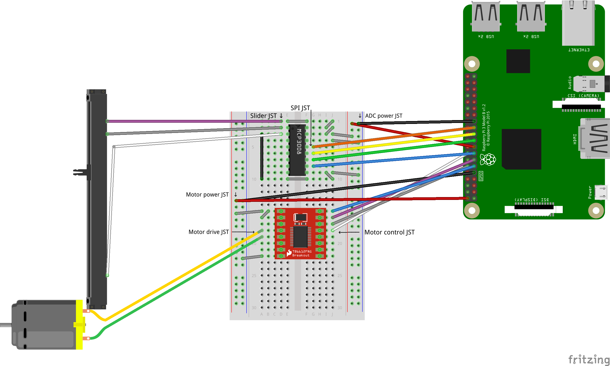
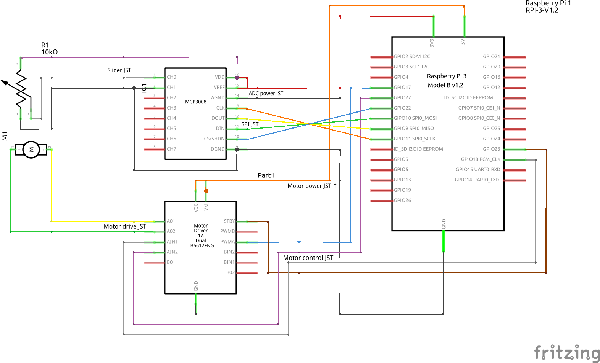

# The Bio Box

## Audio slider control for Raspberry Pi

This project arose out of the desire for a smooth volume control interface for
various sources, especially when livestreaming. Inspired by digital sound desks,
this project allows use of a motorised slider to smoothly adjust a number of
audio or analog sources, such as:

- OBS: Mic, desktop capture, other inputs
- VLC Media Player
- Media in Chrome - see unpacked extension in VolumeSocket
- Webcam focus and exposure
- Pulseaudio - TODO

BioBox can be run on a PC without any kind of analog slider, but its usefulness
will be limited. You still have the benefit of multiple sources controlled in
one place, but adjustment is still done by click-dragging or scrolling.

Dependencies:
=============

Hardware:
- Raspberry Pi B2, B3, B3+, B4 or 400 (tested on B4 only)
- Bourns PSM01-082A-103B2 motorized slide potentiometer 10kΩ
- MCP3008 analog-to-digital converter (ADC)
- TB6612FNG motor controller board
- Breadboard or breadboard layout PCB - 25 rows minimum
- Prototyping plug-to-socket wires
- Short wires for links on breadboard
- JST connectors and sockets for permanent installation

Alternative hardware may be used at the user's discretion, however all low-level
software is based on this implementation.

Software:
- Modern GNU/Linux system with GUI
- Python 3.8+
- `python3-gi` from your package manager
- Python packages as per `requirements.txt`:
  - `gbulb` - Required to run main event loop
  - `adafruit-blinka` and `adafruit-circuitpython-mcp3xxx` - for interfacing with slider
  - `RPi.GPIO` - for motor driver in Motor.py
  - `websockets` - for connecting to OBS and browser extension
  - `v4l2py` - for interfacing with webcams
  - `aiohttp` - for Spotify integration
- [TellMeVLC](https://github.com/Rosuav/TellMeVLC) for VLC integration
- OBS 28+ for OBS integration

Setup:
======

SPI must be enabled to connect to the ADC. This can be done with `raspi-config`
(see [here](https://raspberrypi.stackexchange.com/a/47398/134450) for installation
instructions) or by following [these instructions](https://www.raspberrypi.org/documentation/hardware/raspberrypi/spi/README.md#software).

1. Install dependencies as required for the modules/features you intend to run
2. Copy `config_example.py` to `config.py` and change values as required (some values explained below)
3. For VLC integration, see [TellMeVLC](https://github.com/Rosuav/TellMeVLC)
4. For OBS integration, OBS -> Tools -> WebSocket Server Settings -> Enable WebSocket server, copy port number and password (if applicable) into `config.py`

Webcam control setup:

1. Install `v4l2py` on the server (ie the system with the cameras)
2. Download BioBox or just `camera.py` on the server and note the absolute path to `camera.py`
3. If you do not want BioBox to have access to your main user account on the server, create a new user and add it to the `video` group
4. Enable SSH server and passwordless authentication on the server (See [this guide](https://www.redhat.com/sysadmin/passwordless-ssh) for a tutorial)
5. Set `config.py` with the following:
   - `webcam_user` with the user to login to the server as
   - `webcam_control_path` with the path to `camera.py`
   - `webcams` with the names and device paths of your webcams in `config.py`

Browser extension setup:

Chrome:
1. Modify `VolumeSocket/volsock.js` (line 11) as necessary for the machine running BioBox
2. Open ⠇ -> Extensions -> Manage extensions or go to [chrome://extensions/](chrome://extensions/)
3. Enable Developer mode in the top right
4. Click Load unpacked in the top left
5. Navigate to the BioBox folder and select the VolumeSocket folder

Other Chromium-based browsers will work but installation instructions may vary.
Brave and Opera have been tested and function normally, but YMMV with others.

TODO: Support Firefox - imports but does not run

If BioBox is running on a different machine to the browser, a TLS certificate is required.

TODO: Document TLS setup in detail - perhaps first consider un-hardcoding `volsock.js`
Current setup has `fullchain.pem` and `privkey.pem` symlinked from cert directory

Wiring:
=======

The slider cannot simply connect directly to the Pi for two main reasons. First,
the slider is an analogue component, but the Pi has no analogue inputs. Second,
Pi GPIO pins cannot deliver sufficient power to connect the motor directly to
two GPIO pins - the motor may function, but the speed will be painfully slow.

The solutions to these problems are to add two chips in between the slider and
the Pi - the ADC for the slider, and the motor controller for the motor.

The MCP3008 uses the SPI interface to connect to a controller (see Setup to make
sure SPI is enabled on the Pi). The ADC will need power, ground and four SPI
connections to the Pi, and three[^1] to the slider. You can cross-reference the
connection list below with the [MCP3008 datasheet](https://cdn-shop.adafruit.com/datasheets/MCP3008.pdf).

[^1]: The ADC really needs only one connection to the slider, but the slider also
needs power and ground, which may be convenient to connect to the board from the
ADC.

The motor controller uses two pins to determine direction, a PWM pin to control
speed, and a standby pin to enable or disable the motor entirely, in addition to
power and ground, each for itself and the motor.

If you have never used an electronics breadboard before, see [SparkFun's tutorial](https://learn.sparkfun.com/tutorials/how-to-use-a-breadboard/all).

With the board oriented such that the ravine and rails point away from you,
insert the MCP3008 into the board across the centre ravine, with the notch or
dot pointing towards the top of the board, leaving at least one free row above
(ie from row 2 to row 9).

Connect 3.3V power and ground from the Pi (pins 17 and 25 respectively) to the
right power rail. Add links from the 3.3V rail to row 3 (connecting to VREF),
then from row 3 to row 2 (VDD), then from row 2 to row 1, then finally across
the ravine in row 1.

Connect 1', 2', and 3' on the slider to rows 1, 2, and 3 on the left side of the
board. Add links on the left side of the board from row 3 to row 10, then across
the ravine in row 10, then from row 10 to row 9 (DGND), and finally from row 9
to the ground rail. Add a link from ground also to row 4 (AGND).

Connect rows 5 to 8 to the Pi GPIO 22, SPI MOSI, SPI MISO, and SPI SCLK (pins
15, 19, 21 and 23 respectively).

You should now be able to test the slider's functionality. Run `python3 Analog.py print-value`
from the BioBox directory and move the slider. You should see the value change
between 0 at the bottom of travel and 1023 at the top. Press Ctrl-C to complete
the test. If the direction is inverted, consider swapping the order of wires
from the MCP3008 to the slider, or swapping to/from 1/2/3 and 1'/2'/3'.

Insert the motor controller across the ravine below the MCP by 5 rows including
the link in row 10 (ie insert from row 15 to row 22). Because the motor
controller is 7 pins wide, insert into the board in column D and column H - this
will provide sufficient clearance for the necessary wires and links on both
sides.

Connect 5V power and ground from the Pi (pins 2 and 9 respectively) to the left
power rail. Add links from the 5V rail to row 15 (connecting to VM), then from
row 15 to row 16 (VCC), and finally from row 22 (GND2) to the ground rail.

Connect A and B on the slider to rows 18 and 19 on the left side (A02 and A01).

Connect rows 15 to 18 on the right side to the Pi GPIO 17, 27, 18 and 23 (pins
11, 13, 12 and 16 respectively).

To test the motor, move the slider to the bottom of its travel and run `python3 Analog.py test-motor`.
The slider should move all the way to the top unless it is physically blocked,
in which case it will stop.

Once testing is completed, you can consider a more permanent installation by
soldering the chips to a circuit board and using JST connectors to connect to
the slider and Pi. This is optional but may be necessary if you have problems
with slider drift or incomplete range.

Connections:
============

- MCP3008:
	- CH0  -> Slider 2'
	- CH1  -> Slider 1', GND
	- CH2  unused
	- CH3  unused
	- CH4  unused
	- CH5  unused
	- CH6  unused
	- CH7  unused
	- DGND -> Pi GND  (pin 25)
	- CS   -> Pi GP22 (pin 15)
	- DIN  -> Pi MOSI (pin 19)
	- DOUT -> Pi MISO (pin 21)
	- CLK  -> Pi SCLK (pin 23)
	- AGND -> Pi GND  (pin 25)
	- VREF -> Pi 3.3V (pin 17)
	- VDD  -> Pi 3.3V (pin 17)

- Slider:
	- A  -> TB6 A02
	- B  -> TB6 A01
	- 3 unused
	- 2 unused
	- 1 unused
	- T unused
	- 1' -> MCP CH1 (pin 2)
	- 2' -> MCP CH0 (pin 1)
	- 3' -> MCP VDD (pin 16)

- TB6612FNG:
	- VM   -> Pi +5V  (pin 2)
	- VCC  -> Pi +5V  (pin 2)
	- GND1 unused
	- A01  -> Slider B (black)
	- A02  -> Slider A (red)
	- B02  unused
	- B01  unused
	- GND2 -> Pi GND  (pin 9)
	- GND3 unused
	- PWMB unused
	- BIN2 unused
	- BIN1 unused
	- STBY -> Pi GP23 (pin 16)
	- AIN1 -> Pi GP18 (pin 12)
	- AIN2 -> Pi GP27 (pin 13)
	- PWMA -> Pi GP17 (pin 11)
